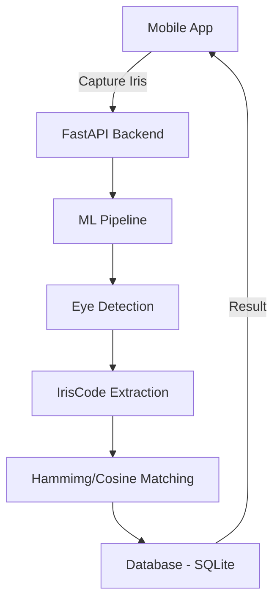

# 👁️ Iris Recognition Attendance System

A state-of-the-art attendance management system utilizing **Iris Recognition** and **Liveness Detection** to ensure secure, touchless, and spoof-proof attendance tracking.


## 🎯 System Overview

This project consists of a high-performance Python backend managing an ML pipeline for iris detection and matching, coupled with a modern Flutter mobile application for administration and scanning.

### Core Features
- **Biometric Iris Scanning**: Advanced encoding (IrisCodes) for unique identification.
- **Anti-Spoofing (Liveness)**: Detects "fake" eyes from photos using texture analysis and reflection checks.
- **Secure Auth**: JWT-based authentication with role-based access (Admin/Staff).
- **Comprehensive Admin App**: Manage students, departments, subjects, and view attendance reports.
- **Robust Connectivity**: Specialized network configuration for seamless laptop-to-mobile communication.

---

## 🏗️ Architecture



---

## 📁 Project Structure

- `backend/`: Python FastAPI service, ML models, and Database.
- `flutter_app/`: Cross-platform mobile application.
- `database/`: Database initialization scripts.

---

## 🚀 Getting Started

### 1. Prerequisites
- **Python 3.10+** (Developed and tested on 3.13)
- **Flutter 3.10+**
- **Same Network**: Laptop and Mobile must be on the same Wi-Fi.

### 2. Fast Setup
For detailed setup, troubleshooting, and error fixes, see the **[HOW_TO_RUN.md](./HOW_TO_RUN.md)** guide.

#### Backend Quick Start
```bash
cd backend
pip install -r requirements.txt
python migrate_db.py  # Critical: Set up tables & columns
uvicorn main:app --reload --host 0.0.0.0 --port 8001
```

#### Flutter Quick Start
```bash
cd flutter_app
flutter pub get
flutter run
```

---

## 🔐 Security & Tech Stack
- **Backend**: FastAPI, SQLAlchemy 2.0, Bcrypt, JWT.
- **ML**: MediaPipe (Detection), Daugman Normalization, Gabor Filters.
- **Storage**: SQLite (Dev-ready), PostgreSQL (Deploy-ready).
- **App**: Flutter, Riverpod (State), Dio (API).

---

## 🆘 Support & Debugging
If you encounter "Connection Refused" or "Not Found" errors on mobile, pre-configured fixes are documented in **[HOW_TO_RUN.md](./HOW_TO_RUN.md)**.

> [!IMPORTANT]
> The system is configured to run on **Port 8001** to avoid conflicts with common system proxies and "Ghost Processes."

---

## 📄 License
This project is licensed under the MIT License.

## 🙏 Acknowledgments
- Inspired by traditional Daugman iris recognition algorithms.
- Built with love for modern biometric security.
